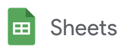

# google-sheet-data-fetcher

[](https://www.npmjs.com/package/google-sheets-data-fetcher)



Fetch data from one or multiple google sheets, without any API key.

## Highlights

- no api key required
- fetch multiple sheets and/or "sub sheets" at once
- write data to separate output json files
- 2 usages:
  - as classical package/dependency
  - via cli/command line
- written in typescript

## Installation

For npm use:

```bash
npm i google-sheets-data-fetcher --save
```

And for yarn use:

```bash
yarn add google-sheets-data-fetcher
```

## Usage

### cli usage

To use the tool on the command line the necessary command is `gsdf` (short for `google-sheet-data-fetcher`).

Details about options/flags following soon.

### package usage

Details following soon.
